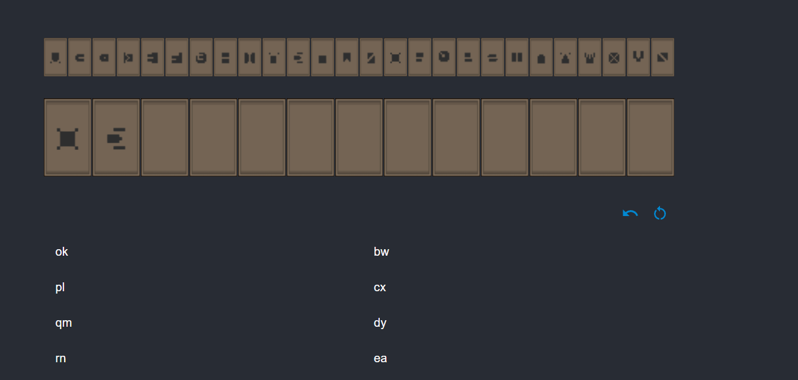

# SDE Decode
Decode language at [7 Days to End with You](https://store.steampowered.com/app/1859280/7_Days_to_End_with_You/)

## Start
```sh
npm install
npm run start
```

## Usage





1. Click letter on top
2. Find appropriate word on the bottom
3. Can remove one letter by pressing 	:arrow_left:
4. Can reset word by pressing :arrows_clockwise:
